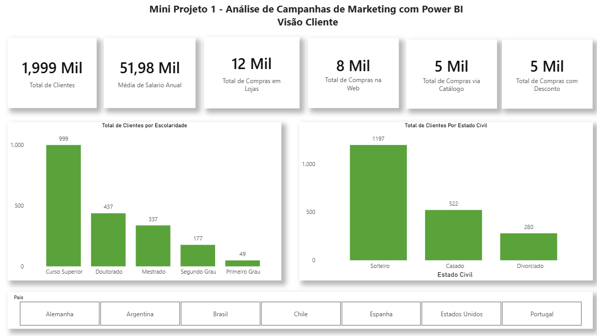
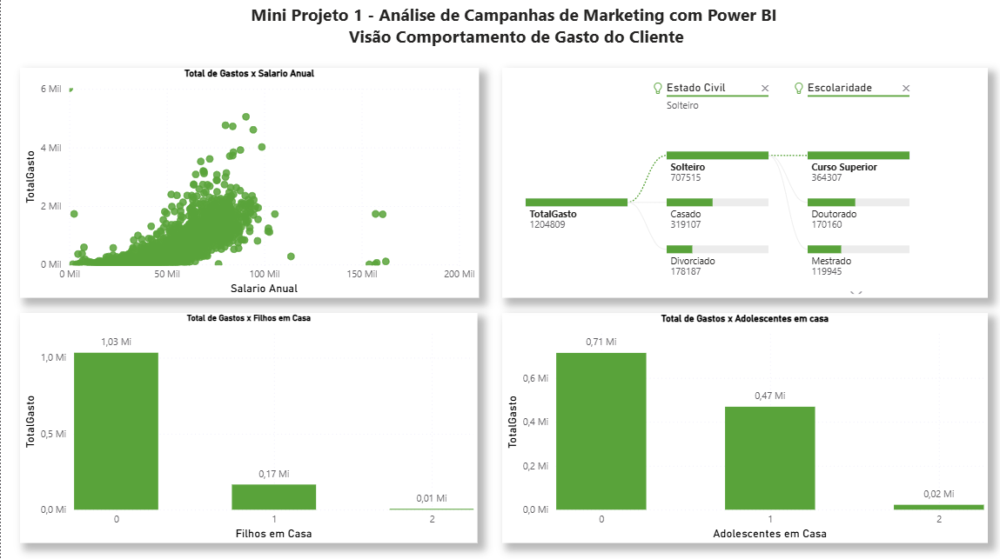
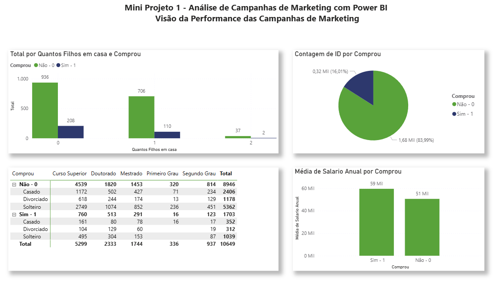
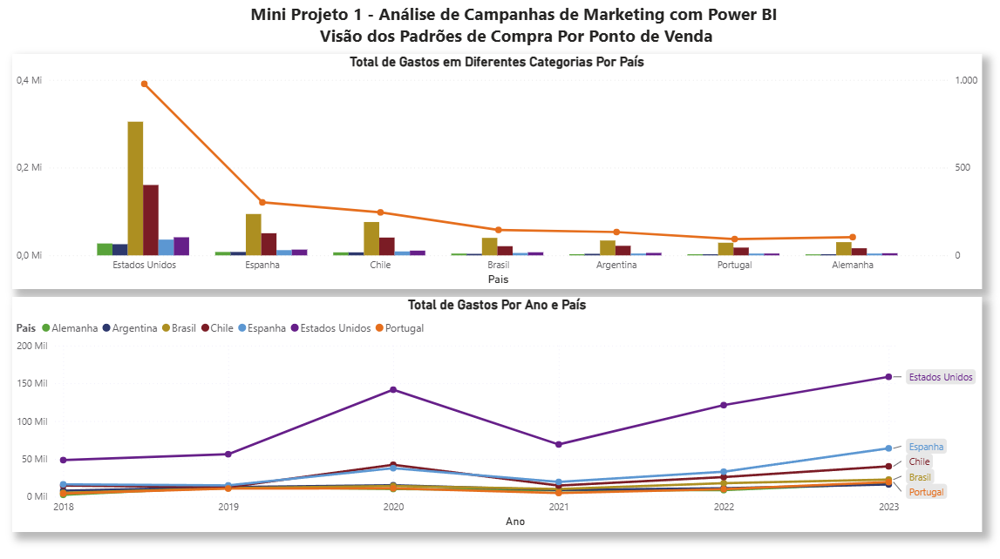

# 📊 Laboratório Prático 3 - Análise de Campanhas de Marketing com Power BI

Projeto desenvolvido durante os estudos de Power BI na Data Science Academy, com foco na análise de dados de marketing, segmentação de clientes e avaliação de campanhas.

## 🎯 Objetivo

Analisar o perfil dos clientes, seus hábitos de compra, a eficiência das campanhas de marketing e os canais de venda, permitindo a geração de insights para apoio à tomada de decisão.

## 🧠 Conceitos Aplicados

* Análise de Dados de Marketing
* KPIs de Marketing
* Segmentação de Clientes
* Criação de Medidas com DAX
* Tratamento de Outliers
* Árvore Hierárquica
* Segmentações e Filtros Interativos
* Storytelling com Dados
* Visualizações Interativas

## 👥 Dashboard 1 - Visão do Cliente

Este dashboard apresenta informações sobre o perfil dos clientes, incluindo características demográficas, escolaridade e estado civil, permitindo identificar padrões e segmentos de público.

---

## 💰 Dashboard 2 - Visão do Comportamento de Compra

Análise do comportamento de consumo dos clientes, explorando a relação entre gastos, renda e características pessoais para compreender padrões de compra.

---

## 📢 Dashboard 3 - Visão das Campanhas de Marketing

Painel destinado à avaliação da performance das campanhas de marketing, permitindo analisar resultados e identificar oportunidades de melhoria.

---

## 🛒 Dashboard 4 - Visão dos Pontos de Venda

Dashboard voltado para a análise dos canais e pontos de venda, destacando padrões de compra e preferências dos clientes.

---

## 🛠️ Ferramentas Utilizadas

* Power BI
* Power Query
* DAX
* Modelagem de Dados
