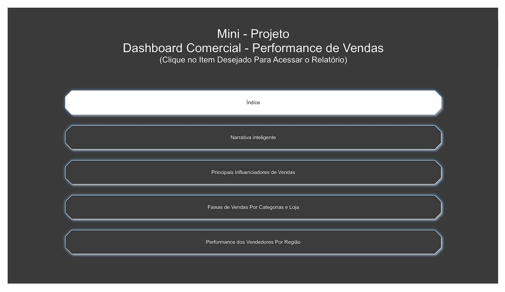
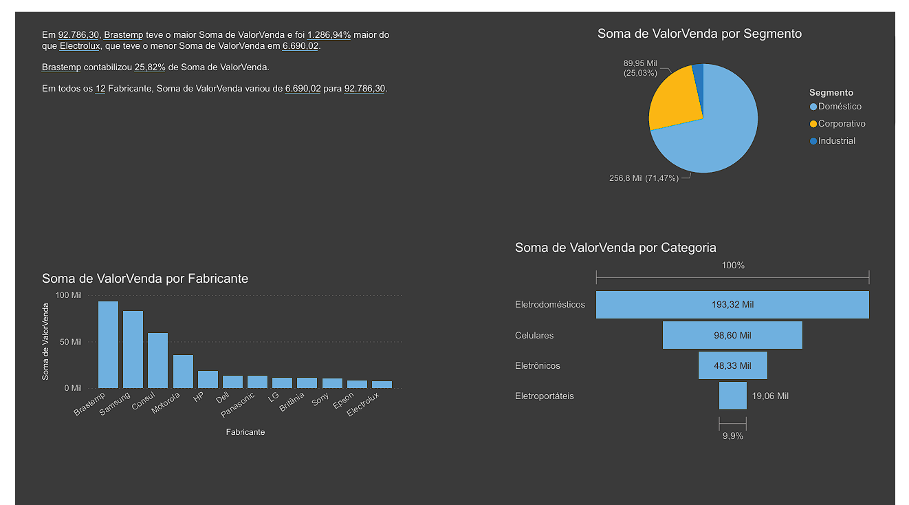
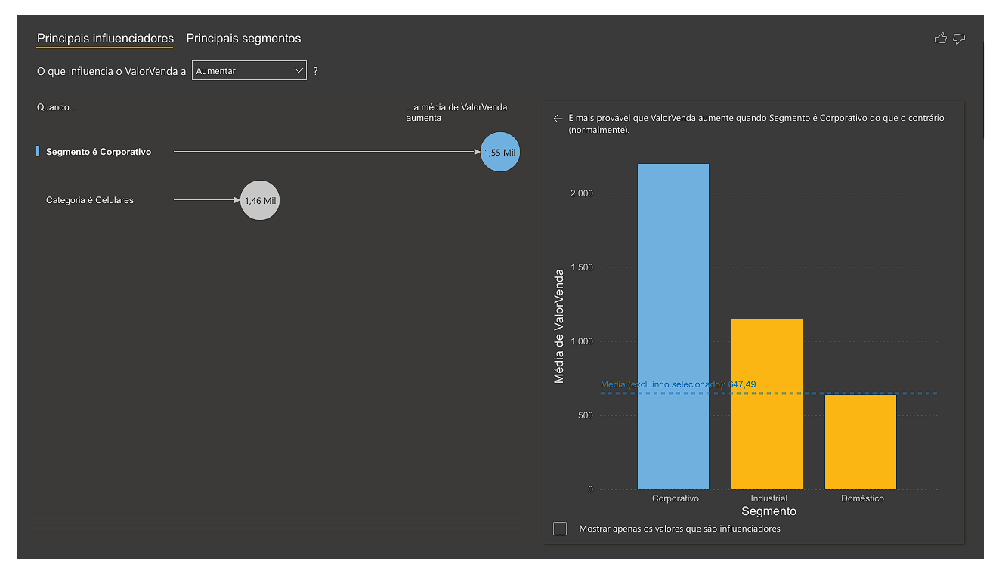
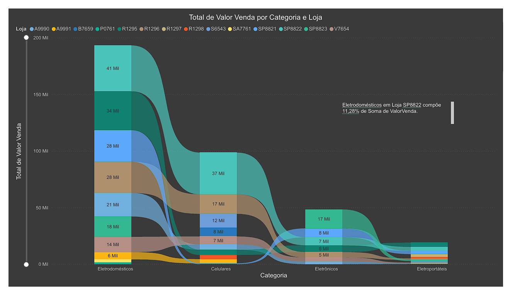
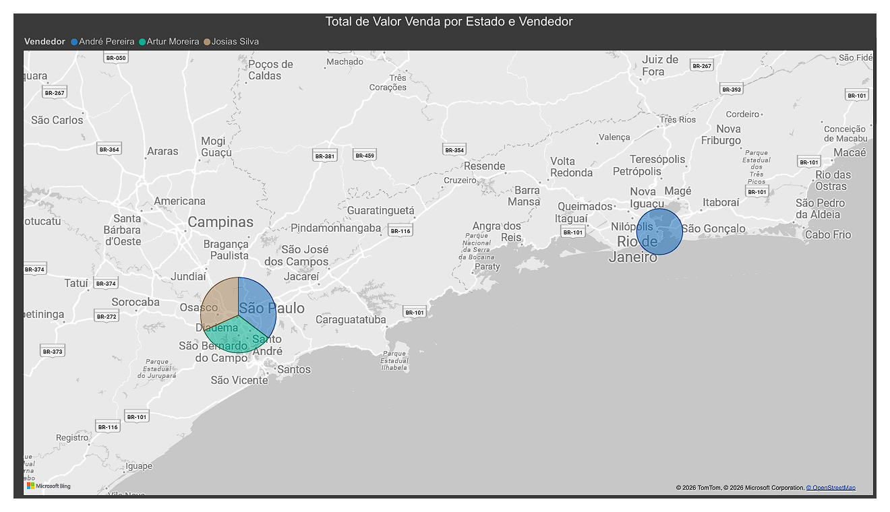

# 📊 Laboratório Prático 4 - Dashboard Comercial: Performance de Vendas

Projeto desenvolvido durante os estudos de Power BI na Data Science Academy, com foco na análise de dados comerciais e desempenho de vendas.

## 🎯 Objetivo

Analisar indicadores comerciais e identificar fatores que impactam os resultados de vendas, permitindo a extração de insights para apoio à tomada de decisão.

## 🧠 Conceitos Aplicados

* Análise de Dados Comerciais
* KPIs de Vendas
* Narrativa Inteligente
* Principais Influenciadores
* Gráfico de Faixas
* Análise Geográfica
* Navegação entre Relatórios
* Storytelling com Dados
* Visualizações Interativas

## 🏠 Dashboard Inicial - Índice

Página desenvolvida para facilitar a navegação entre os relatórios do projeto.

---

## 📝 Dashboard 1 - Narrativa Inteligente

Utilização do recurso de Narrativa Inteligente do Power BI para geração automática de insights sobre os dados de vendas.

---

## 🎯 Dashboard 2 - Principais Influenciadores de Vendas

Análise dos fatores que mais influenciam os resultados comerciais, permitindo identificar padrões e oportunidades de melhoria.

---

## 📊 Dashboard 3 - Faixas de Vendas por Categoria e Loja

Avaliação do desempenho das vendas por categoria de produto e ponto de venda utilizando gráfico de faixas.

---

## 🌎 Dashboard 4 - Performance dos Vendedores por Região

Análise geográfica da performance dos vendedores, permitindo comparar resultados entre diferentes regiões.

---

## 🛠️ Ferramentas Utilizadas

* Power BI
* Power Query
* Narrativa Inteligente
* Principais Influenciadores
* Mapas
* Visualizações Interativas

## 📚 Fonte de Estudo

Curso: Microsoft Power BI Para Business Intelligence e Data Science

Data Science Academy
