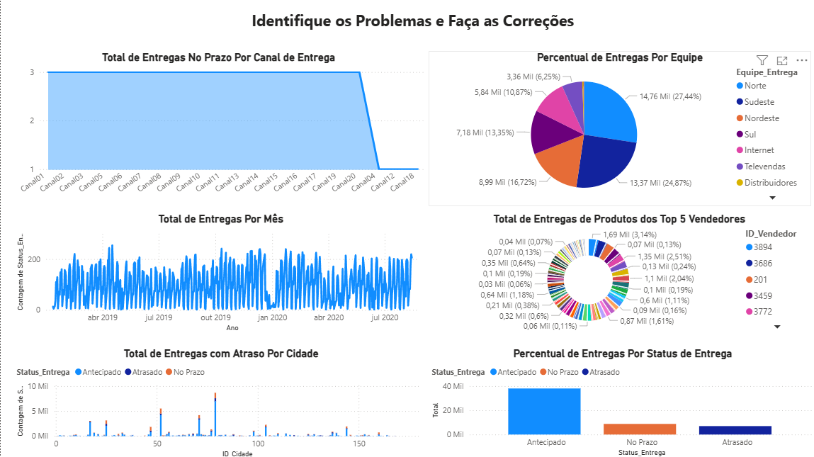
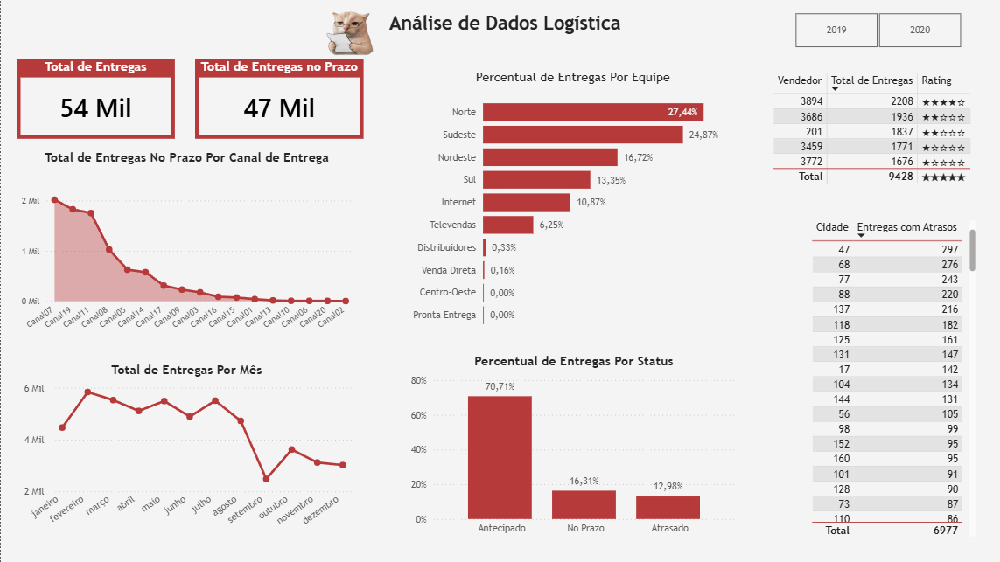

# Laboratório 5

## Desconstruindo o Dashboard e Resolvendo Problemas de Análise na Área de Logística

### Objetivo
Neste laboratório, o objetivo é analisar um dashboard da área de logística que apresenta diversos problemas de organização visual, disposição de informações e interpretação dos dados.

A proposta consiste em identificar os problemas existentes e aplicar melhorias para tornar o dashboard mais intuitivo, organizado e eficiente para a tomada de decisões.

---

### Dashboard Original

---

### Problemas Identificados

- Falta de hierarquia visual clara
- KPIs pouco destacados ou confusos
- Excesso de informações sem organização
- Dificuldade de leitura dos principais indicadores
- Baixa padronização visual entre gráficos
- Falta de foco em métricas principais de logística

---

### Melhorias Aplicadas

- Reorganização dos KPIs principais na parte superior do dashboard
- Melhoria da hierarquia visual para destacar métricas importantes
- Ajuste de cores para melhorar contraste e leitura
- Separação mais clara entre tipos de análise (entregas, atrasos, desempenho)
- Reestruturação dos gráficos para facilitar interpretação

---

### Dashboard Final

---

### Aprendizados

- A importância da hierarquia visual em dashboards
- Como pequenos ajustes de layout melhoram a leitura dos dados
- Uso de KPIs para direcionar a análise
- Como a clareza visual impacta diretamente a tomada de decisão

---

### Conclusão
A desconstrução do dashboard mostrou que não basta ter dados — é essencial organizá-los de forma clara, intuitiva e orientada à decisão.
